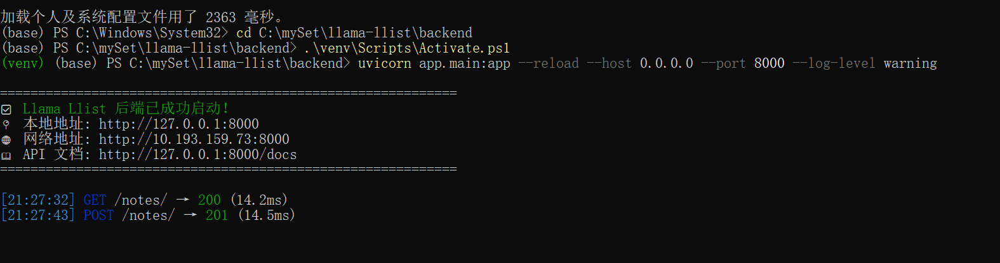
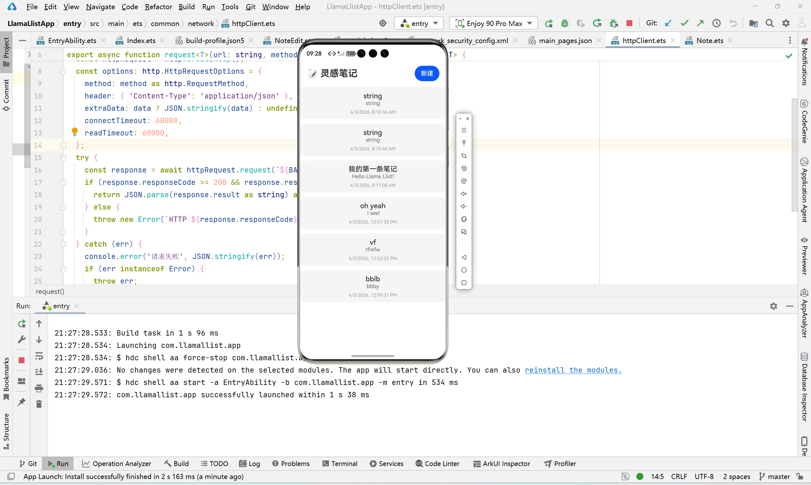
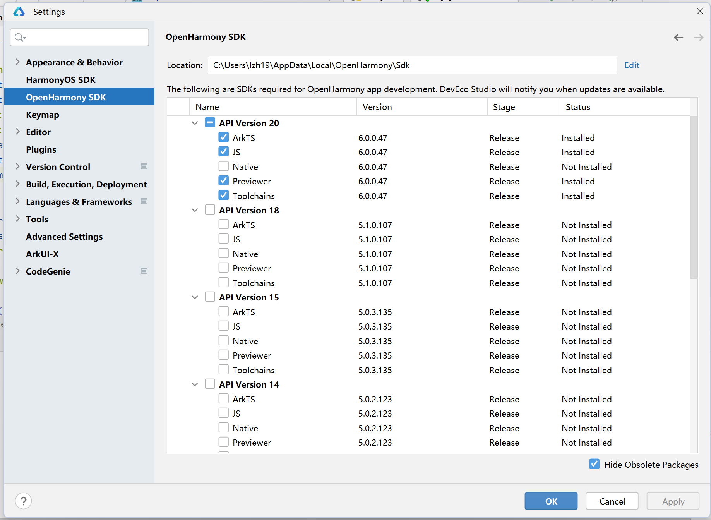
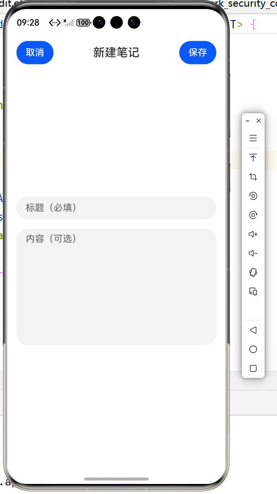

# 🦙 Llama Llist – 灵感笔记与待办清单

> 一个集笔记记录与任务管理于一体的效率工具。支持多模态笔记、标签分类、待办状态机、搜索筛选，并为后续 AI 功能预留扩展点。

## 📚 技术栈

| 层级 | 技术 |
|------|------|
| 前端 | HarmonyOS ArkUI (ArkTS) 声明式语法 |
| 后端 | Python + FastAPI + SQLAlchemy (异步) |
| 数据库 | SQLite (开发环境) / PostgreSQL (生产可选) |
| 通信 | HTTP + JSON (RESTful API) |
| 文档 | FastAPI 自动生成 OpenAPI (Swagger) |

## 📁 目录结构
```
llama-llist/
├── frontend/                                 # HarmonyOS 工程（用 DevEco Studio 打开）
│   └── entry/src/main/ets/
│       ├── pages/                            # 页面
│       │   ├── Index.ets                     # 笔记列表页 ✅
│       │   ├── NoteEdit.ets                  # 新增/编辑笔记页 ✅
│       │   ├── TagManage.ets                 # 标签管理页 ⏳
│       │   ├── TodoBoard.ets                 # 待办看板页 ⏳
│       │   └── SearchPage.ets                # 搜索筛选页 ⏳
│       ├── common/                           # 公共模块
│       │   ├── network/
│       │   │   └── httpClient.ets            # HTTP 请求封装 ✅
│       │   ├── constants/
│       │   │   └── Config.ets                # 全局配置（BASE_URL等）✅
│       │   └── utils/                        # 工具函数（日期格式化等）⏳
│       ├── models/                           # 数据模型
│       │   ├── Note.ets                      # 笔记模型 ✅
│       │   ├── Tag.ets                       # 标签模型 ⏳
│       │   └── Todo.ets                      # 待办模型 ⏳
│       └── database/                         # 本地数据库（本次作业未使用，为后续预留）
├── backend/                                  # Python 后端
│   ├── app/
│   │   ├── __init__.py
│   │   ├── main.py                           # FastAPI 入口（含 CORS、日志中间件）✅
│   │   ├── database.py                       # 数据库连接（异步 SQLite）✅
│   │   ├── models.py                         # SQLAlchemy 模型（Note, Tag）✅
│   │   ├── schemas.py                        # Pydantic 模型（Note, Tag）✅
│   │   ├── crud.py                           # 数据库操作（笔记 CRUD）✅
│   │   └── routers/                          # 路由模块
│   │       ├── __init__.py
│   │       ├── notes.py                      # 笔记相关 API ✅
│   │       ├── tags.py                       # 标签相关 API ⏳
│   │       └── todos.py                      # 待办相关 API ⏳
│   ├── uploads/                              # 用户上传图片目录（自动生成）
│   ├── notes.db                              # SQLite 数据库文件（自动生成）
│   ├── requirements.txt                      # Python 依赖 ✅
│   ├── .env                                  # 环境变量（可选，不提交）
│   └── config.py                             # 配置管理（可选，已规划）
├── docs/                                     # 文档
│   ├── API.md                                # 接口文档（待补充）
│   └── architecture.png                      # 架构图（待补充）
├── .gitignore                                # Git 忽略规则 ✅
└── README.md                                 # 项目说明 ✅
```


## 🚀 启动指南

### 后端启动



1. **进入后端目录**
   ```bash
   cd backend

2. **创建并激活虚拟环境**
    Windows (PowerShell):
    python -m venv venv
    .\venv\Scripts\Activate.ps1

    macOS/Linux:
    python3 -m venv venv
    source venv/bin/activate

3. **安装依赖**
   pip install -r requirements.txt

4. **启动服务**
   uvicorn app.main:app --reload --host 0.0.0.0 --port 8000 --log-level warning

### 前端启动




1. **使用 DevEco Studio 打开项目**  
   选择 `Open Project`，定位到 `frontend` 目录。


2. **配置 hdc 环境变量（用于端口转发或设备连接）**  
- ！请确保安装了**OpenHarmony SDK**
  
   
   - 找到 HarmonyOS SDK 安装目录下的 `toolchains` 文件夹（默认 `C:\Users\你的用户名\AppData\Local\Huawei\Sdk\openharmony\20\toolchains`）。  
   - 将该路径添加到系统 `PATH` 环境变量中，或者在使用 `hdc` 命令时使用绝对路径。  
   - 验证配置：打开新终端，输入 `hdc list targets`，应显示已连接的设备（模拟器或真机）。

3. **运行应用**  
   - 连接真机或启动模拟器（推荐 API 12+）。  
   - 点击 DevEco Studio 的运行按钮，等待安装并启动。



## API 接口概览

| 方法   | 路径            | 说明                     | 状态码 |
|--------|----------------|--------------------------|--------|
| GET    | `/`            | 健康检查                 | 200    |
| GET    | `/notes/`      | 获取笔记列表（支持分页） | 200    |
| POST   | `/notes/`      | 创建新笔记               | 201    |
| GET    | `/notes/{id}`  | 获取单条笔记             | 200    |
| PUT    | `/notes/{id}`  | 更新笔记                 | 200    |
| DELETE | `/notes/{id}`  | 删除笔记                 | 204    |
| GET    | `/tags/`       | 获取所有标签             | 200    |
| POST   | `/tags/`       | 创建标签                 | 201    |
| ...    | ...            | 更多接口见 `/docs`       | ...    |

> 详细请求/响应格式请访问 `http://localhost:8000/docs`（后端启动后）

## 前端 BASE_URL 配置
- 统一在 common/constants/Config.ets 中修改 BASE_URL
- 我使用的是虚拟网络，BASE_URL 固定为 http://10.0.2.2:8000，不需要修改

## 📌 数据库现状与待完善之处

当前 `models.py` 已包含以下表：

- `notes`：笔记主表（标题、内容、图片路径、时间戳、标签外键、预留的 `embedding` 向量字段）
- `tags`：标签表（名称唯一）
- `todos`：待办表（标题、状态、截止日期、关联笔记 ID）

**已满足的功能**：笔记 CRUD、标签关联、待办基础结构。  
**后续可完善的方向**：

| 方向 | 说明 |
|------|------|
| **索引优化** | 为 `notes.created_at`、`todos.status`、`todos.deadline` 添加索引以提升查询性能 |
| **级联删除** | `note_id` 外键可添加 `ondelete="CASCADE"`，使删除笔记时自动删除关联的待办 |
| **embedding 字段** | 当前为 `Text` 类型，实际使用时需将向量序列化为 JSON 字符串；后续可改用 `Vector` 类型（需第三方扩展） |
| **图片存储** | `image_paths` 存储逗号分隔路径，建议改为一对多关联表，支持更灵活的图片管理 |
| **数据库迁移** | 目前使用 `Base.metadata.create_all`，生产环境建议引入 `Alembic` 进行版本化迁移 |

---


## 🤖 为第三次作业预留的 AI 扩展点

- **数据库层**：`Note` 模型已预留 `embedding` 字段（Text 类型），用于存储向量，便于实现语义搜索。
- **后端接口**：计划新增 `/ai/summarize`（笔记摘要）、`/ai/classify`（智能标签）、`/ai/priority`（任务优先级推荐）等端点，当前可返回 Mock 数据。
- **前端**：笔记详情页已预留「AI 助手」按钮位置，点击后调用 AI 接口。